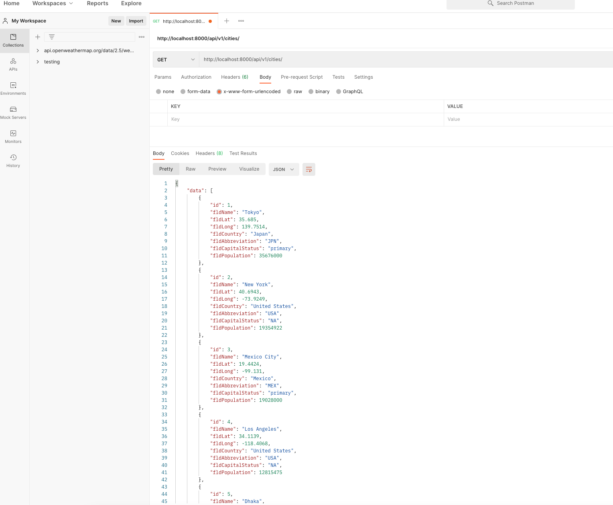
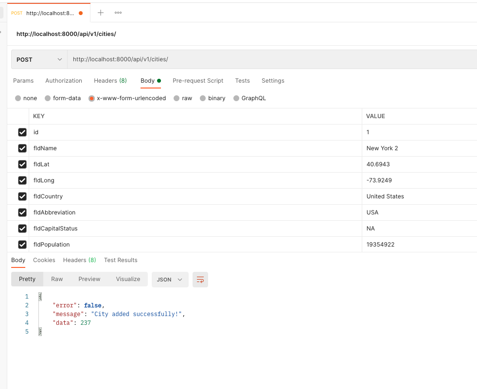
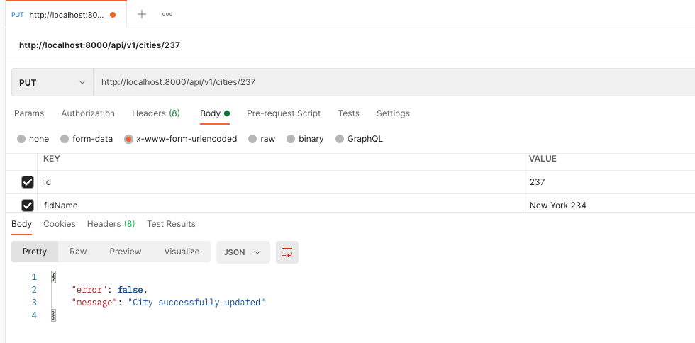
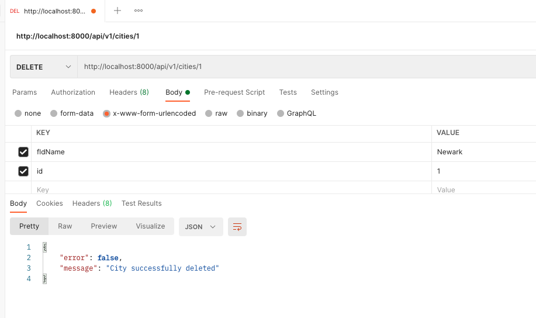

# WebpackCrud
using CRUD in an express app while using webpack

## GET

#### get all records

#### get 1 record

## POST

#### Using post

#### result after post

## PUT

#### put a record

#### result after put

## DELETE

#### delete one record

#### result after delete

